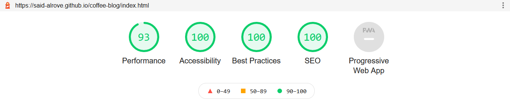
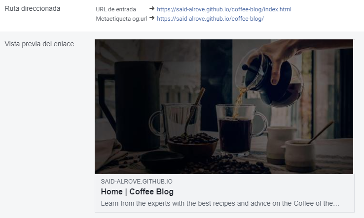
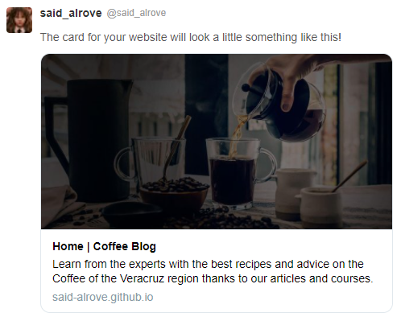

# [coffee-blog](https://said-alrove.github.io/coffee-blog/)
The fourth project from Juan Pablo's course of Web Development.

## Project's preview

## What I learned
In this project, I continued practicing with the SMACSS methodology (maybe in the next project I'll apply another architecture for building projects with SASS).

I have a few doubts about the picture element...I thought that when you put properties in the img tag that's inside the picture element, you didn't have to add them in the source tag (due to the img tag is rendered first for the browser, and then...once it's already charged, if it's possible, it changes the image for the one available in the source tag, but...the properties in the img tag are kept). But in the part of the course where this project was, the instructor put properties like "loading" twice in picture elements (one in the source tag, and the other in the img tag)...so I'm a little bit confused about it even though I'm almost sure that I'm right (I'll keep looking for more information until be completely sure about everything I mentioned before).

I also tried to use more utilities in the project thus I created classes like "no-margin", "no-padding", "txt-center", etc. (I'll keep looking for more utilities that could be useful for me in future projects).

That'd be everything for this project :D.

Update: I've already found out more information about properties like "loading" in the picture element, and I was right (you should put the properties like "loading" or "alt" in the img tag only), for more information you can check [this article](https://web.dev/browser-level-image-lazy-loading/).

## Lighthouse

## Facebook
Each page has a different card (image, title, description, etc.).

## Twitter
Each page has a different card (image, title, description, etc.).
