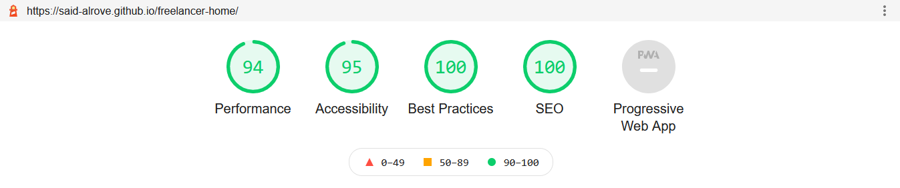

# [freelancer-home](https://said-alrove.github.io/freelancer-home/)
The first project from Juan Pablo's course of Web Development.

## Project's preview

## What I learned
I figured out how to use the [Open Graph Protocole](https://ogp.me/) ([Facebook](https://ahrefs.com/blog/open-graph-meta-tags/#:~:text=Open%20Graph%20meta%20tags%20are%20snippets%20of%20code,them%20in%20the%20%3Chead%3E%20section%20of%20a%20webpage.) and [Twitter](https://warfareplugins.com/open-graph-tags-twitter-cards-rich-pins/#:~:text=Twitter%20cards%20are%20pretty%20much%20exactly%20like%20Open,Cards%3A%20Title%2C%20description%2C%20thumbnail%2C%20and%20Twitter%20account%20attribution.)).

I also implemented an specific way to order the properties in the CSS code that's a combination of 2 kinda ways for ordering, the first one a.k.a "[Outside In](https://webdesign.tutsplus.com/articles/outside-in-ordering-css-properties-by-importance--cms-21685)", and the second one which's my own modification about the Outside In.

What are those modifications? Well, what I did was basically add a order inside the order, e.g. let's imagine that we have 3 properties (margin, width, and padding), the way how you'd order them with the tipycal Outside In doesn't really care, there's no an specific rule for it, so I decided to order the chunks of properties by the ones that affect outside first, and then the ones that affect inside (Similar to the "Outside In" technique with the chunks), so, how do you order the properties in the different chunks? Well, let's see 2 examples:

1.- Margin, padding, width < margin, width, and padding.

2.- Background-color, box-shadow, color < box-shadow, background-color, color.

From my perspective this way looks better :D.

And of course I also learned how to use the scroll-bar effect with the different properties that we have (I just used a few of them, I'll use more of them in more advanced projects). [Here](https://blog.logrocket.com/how-to-use-css-scroll-snap/#:~:text=How%20CSS%20Scroll%20Snap%20works.%20CSS%20Scroll%20Snap,%7B%20scroll-snap-type%3A%20%5B%20x%20%7C%20y%20%7C%20) is an interested article about some scroll properties.

### Lighthouse

### Open Graph Facebook

### Open Graph Twitter
