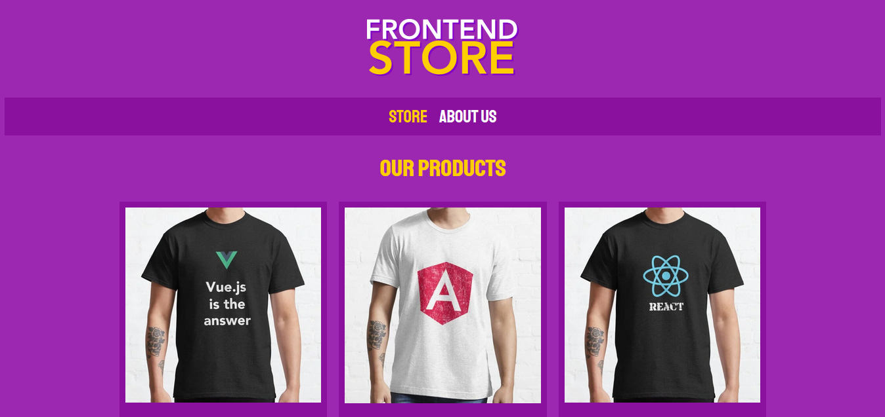
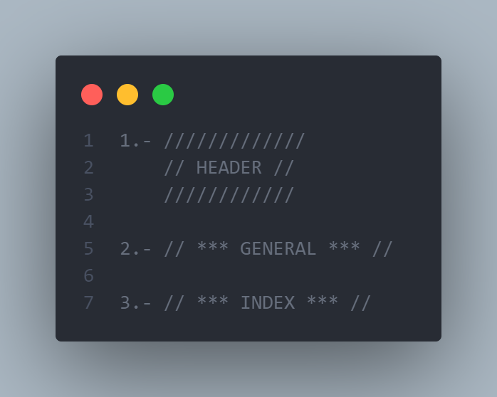
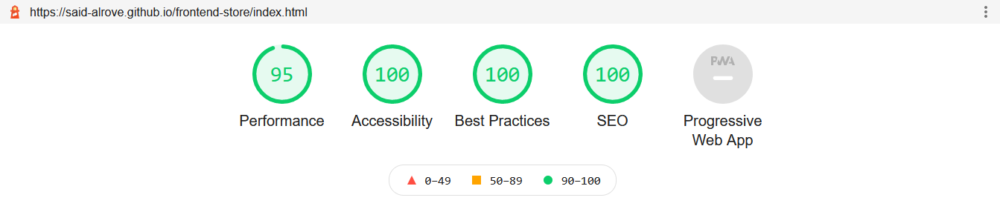
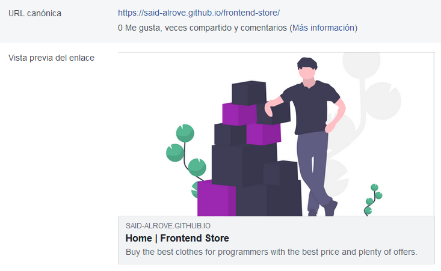
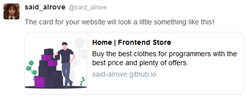

# [frontend-store](https://said-alrove.github.io/frontend-store/)
The second project from Juan Pablo's course of Web Development.

## Project's preview

## What I learned
I learned how to use the [SMACSS methodology](https://itnext.io/css-architecture-with-sass-smacss-and-bem-cc618392c148) for structuring SASS projects (base, modules, layout, theme, state), and this is my first time using it, therefore there should be several mistakes in the way how I decided to order and clasificate the different stylesheets.

First, I wasn't sure about what exactly is "theme", I mean...typography and colors, ok...but code? or variables?, so I chose the second option. In most of the cases I assigned a folder for each topic with the same name as the document, but there is one exception...the theme folder, I decided to call it "members" basically because that's how are known those things in SASS (variables, mixins, extends, etc...), and inside of it I created 2 SASS modules, one of them called "theme" that as you might guess has the color and fonts variables, and the other called "mixins" (I guess there's no need for explications).

Second, in a course that I was watching, the teacher said that we should separate the layout stylesheets into 2 sub stylesheets, one of them with the "layout" properties in essence (like position, grid, flexbox, width, etc...), and the second one with the styles (colors, fonts, etc...), therefore in the layout folder there are 2 stylesheets, one of them called "layout.scss" and the other one "layout-styles.scss".

Third, the way how I separated the different pages' styles was by adding different comments. On each important component I put a comment as a box (first example below), and when a component was something general (I mean, that I used it more than once because is something needed in each page like the nav or the footer) I created a comment a few different from the box-comments (second example below) to difference them, and for separating the components according to their pages I created a comment alike to the one mentioned before but with the name of the page the components are related to (third example below).

Now, I also learned how to optimize the page load by doing a few things:

1.- Compressing images to make them lighter by using [this page](https://tinypng.com/).

2.- Converting those compressed images (wich could be jpg, png, etc...) into webp images by using [this page](https://imagen.online-convert.com/es/convertir-a-webp).

3.- Using both formats thanks to the [picture element](https://www.w3schools.com/htmL/html_images_picture.asp) in HTML.

Furthermore I learned how to change the tab's color by using the meta tag [theme-color](https://webhint.io/docs/user-guide/hints/hint-meta-theme-color/#:~:text=The%20theme-color%20meta%20tag%20provides%20a%20way%20to,highlight%20in%20a%20tab%20bar%20or%20task%20switcher.) and I found out that the ideal size for Facebook Open Graph images should be 1200x630 according to their own [documentation](https://developers.facebook.com/docs/sharing/webmasters/images), this because that way the definition is perfect for most of the screens.

That'd be everything for this project! :D.

Update: I added a couple mixins for creating Flexbox and Grid layouts faster (I just have to put the kinda mixin I'll use, either Flexbox or Grid, and specify each variable (I assigned a shorter name for each propertie where was possible, e.g. justify-content > justify) with its value).

If you want to check out those mixins to see how they work, you must go to the members folder and check the mixins file.

And I also tried to get a better lighthouse performance by using lighter image formats as webp and avif instead of jpg or png, that way the charge of the site, in general, is faster (avif still needs a bit more support, it has 67% now, that's the reason I put it as the second option int he fallback). Furthermore, I added the full URL direction to each and every element that needs a source (I've already explained why in the [easy-recipe](https://github.com/said-alrove/easy-recipe) project).

### Lighthouse

### Open Graph Facebook

### Open Graph Twitter
